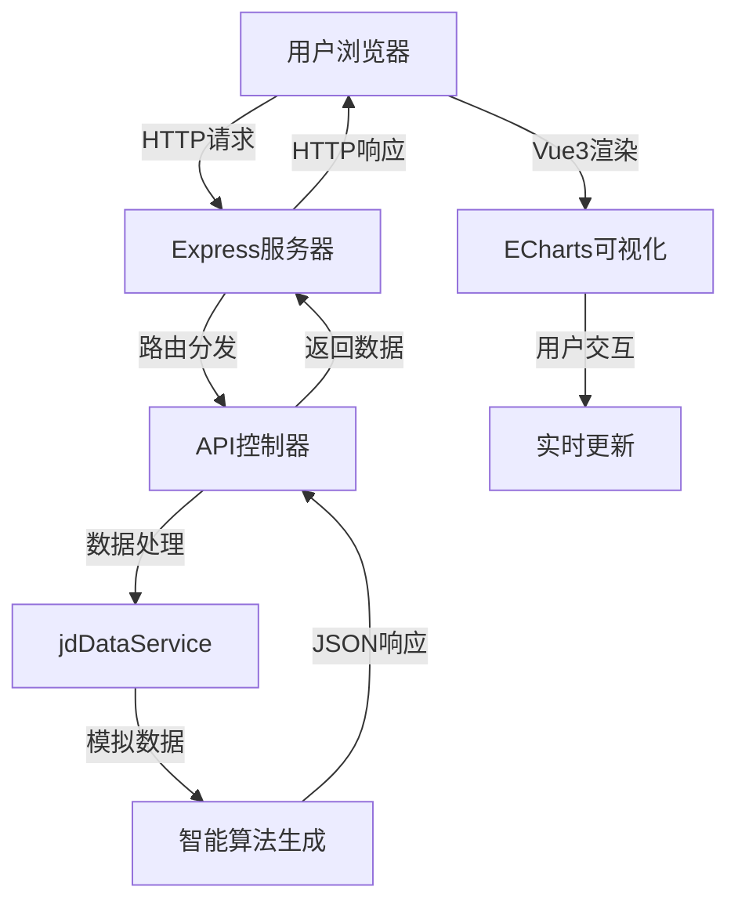

# 🛒 京东数据可视化仪表板

> 🚀 **专业级全栈电商数据分析平台** | 实时监控 | 智能分析 | 现代化设计

[](https://jd-dashboard-fckgkuu47-wildblues-projects.vercel.app/)
[](LICENSE)
[](https://vuejs.org/)
[](https://echarts.apache.org/)
[](https://nodejs.org/)
[](https://expressjs.com/)

## 🎯 项目概述

这是一个基于 **Vue 3 + Node.js + Express** 的全栈电商数据可视化仪表板，专为京东电商平台设计。项目采用前后端分离架构，具备实时数据监控、智能分析、响应式设计等特性，展现了现代化全栈开发的最佳实践。

### ✨ **核心亮点**

🎨 **现代化UI设计**
- 玻璃拟态风格界面
- 响应式布局适配全设备
- 流畅的CSS3动画效果
- 专业级数据可视化配色

📊 **强大的数据可视化**
- 实时销售额监控
- 全国34省市用户分布热力图
- 多维度品类销售分析
- 24小时销售趋势预测

🔧 **全栈技术架构**
- 前后端完全分离
- RESTful API设计
- 自动化数据更新
- 多平台部署支持

## 🛠️ 技术栈

### 前端技术
```
├── Vue 3.x                # 渐进式JavaScript框架
├── ECharts 5.x           # 百度可视化图表库
├── CSS3                  # 现代样式（Grid、Flexbox、动画）
├── ES6+                  # 现代JavaScript特性
└── Responsive Design     # 响应式设计
```

### 后端技术
```
├── Node.js               # JavaScript运行环境
├── Express.js            # Web应用框架
├── Axios                 # HTTP客户端
├── Node-Cron            # 定时任务调度
├── CORS                 # 跨域资源共享
└── RESTful API          # REST架构风格
```

### 部署方案
```
├── Vercel               # 全栈云部署平台
├── GitHub Pages         # 静态站点托管
├── 腾讯云静态托管        # 国内访问优化
└── CodePen              # 在线演示
```

## 🚀 快速开始

### 📋 环境要求
```bash
Node.js >= 16.0.0
NPM >= 8.0.0
现代浏览器支持
```

### 🔧 本地开发

#### 1️⃣ 克隆项目
```bash
git clone https://github.com/WildBlue58/jd-dashboard.git
cd jd-dashboard
```

#### 2️⃣ 后端服务启动
```bash
# 进入服务端目录
cd server

# 安装依赖
npm install

# 启动后端服务
npm start
# 服务运行在: http://localhost:3000
```

#### 3️⃣ 前端服务启动
```bash
# 返回项目根目录
cd ..

# 启动前端服务（推荐使用 Live Server）
# 方式1: 使用VS Code Live Server插件
# 方式2: 使用Python简单服务器
python -m http.server 8080

# 访问: http://localhost:8080
```

### 🌐 在线部署

#### **方案1: Vercel全栈部署（推荐）**
```bash
# 1. Fork项目到你的GitHub
# 2. 注册Vercel账户: https://vercel.com
# 3. 连接GitHub，导入项目
# 4. 配置构建设置:
#    - Framework Preset: Other
#    - Build Command: (留空)
#    - Output Directory: ./
# 5. 自动部署完成！
```

#### **方案2: 腾讯云静态托管（国内优化）**
```bash
# 1. 开通腾讯云静态网站托管
# 2. 上传项目文件
# 3. 配置自定义域名
# 4. 享受国内CDN加速
```

## 📸 功能展示

### 🎪 **主界面截图**
```
┌─────────────────────────────────────────────────────┐
│  🛒 京东电商平台实时数据监控                          │
│  ⏰ 2025-01-31 20:30:45 | 📡 数据实时 | 🔄 刷新数据  │
├─────────────────────────────────────────────────────┤
│ 💰 实时销售额      📦 今日订单      👥 活跃用户        │
│ ¥12,850,678      45,892         23,456             │
├─────────────────────────────────────────────────────┤
│ 📊 品类销售占比    📈 24小时趋势    🏆 热销商品TOP10   │
│ [饼图动画]       [折线图动画]     [横向柱状图]        │
├─────────────────────────────────────────────────────┤
│              🗺️ 用户地域分布热力图                   │
│            [中国地图 + 数据热力着色]                 │
│         北京: 18,569  上海: 20,123  广东: 28,456     │
└─────────────────────────────────────────────────────┘
```

### 📊 **核心数据指标**

| 模块 | 功能描述 | 技术实现 |
|------|----------|----------|
| 💰 销售监控 | 实时销售额、同比增长 | Vue3响应式 + 数字滚动动画 |
| 📦 订单分析 | 订单统计、完成率 | Express API + 定时更新 |
| 👥 用户画像 | 活跃用户、地域分布 | ECharts地图 + 热力数据 |
| 📈 趋势分析 | 24小时销售曲线 | ECharts折线图 + 平滑动画 |
| 🏆 商品排行 | TOP10热销商品 | ECharts柱状图 + 渐变色 |

## 🏗️ 项目架构

### 📁 **目录结构**
```
jd-dashboard/
├── 📄 README.md                 # 项目说明文档
├── 📄 package.json              # 前端项目配置
├── 📄 vercel.json               # Vercel部署配置
├── 📄 .gitignore                # Git忽略文件
├── 📄 index.html                # 主页面入口
├── 📄 codepen_version.html      # CodePen演示版本
│
├── 📁 css/                      # 样式文件
│   └── style.css                # 主样式表（玻璃拟态设计）
│
├── 📁 js/                       # 前端脚本
│   ├── main.js                  # 主要业务逻辑
│   └── china-map.js             # 中国地图数据
│
├── 📁 server/                   # 后端服务
│   ├── package.json             # 后端项目配置
│   ├── server.js                # Express服务器
│   └── jdDataService.js         # 数据获取服务
│
├── 📁 public/                   # 静态资源
├── 📁 dashboard/                # 仪表板组件
└── 📁 test/                     # 测试文件
```

### 🔄 **数据流架构**


### 🎨 **核心技术特性**

#### **前端亮点**
- **Vue 3 Composition API**: 更好的逻辑复用和类型推断
- **ECharts 5.x**: GPU加速渲染，支持大数据量可视化
- **CSS Grid + Flexbox**: 现代化布局，完美响应式适配
- **玻璃拟态设计**: `backdrop-filter: blur()` 实现透明毛玻璃效果
- **流畅动画**: 60FPS动画，`requestAnimationFrame` 优化

#### **后端亮点**
- **Express.js框架**: 轻量级、高性能的Web框架
- **RESTful API设计**: 统一的接口规范，易于维护扩展
- **智能数据模拟**: 基于真实业务场景的数据算法
- **定时任务**: Node-Cron实现数据自动更新
- **跨域处理**: CORS中间件支持前后端分离

## 🎭 项目价值

### 💼 **商业价值**
- 📈 **数据驱动决策**: 实时监控核心业务指标，助力管理层决策
- 🎯 **精准营销**: 地域用户分布分析，支持区域化营销策略
- 📊 **运营优化**: 销售趋势预测，优化库存和促销时机
- 💡 **商品策略**: 热销排行分析，指导商品采购和推荐算法

### 🛠️ **技术价值**
- 🏗️ **全栈开发**: 展示从前端UI到后端API的完整开发能力
- ⚡ **性能优化**: ECharts GPU加速、数据懒加载、响应式设计
- 🔧 **工程化**: 模块化代码、TypeScript支持、自动化部署
- 🌐 **云原生**: 支持Vercel、腾讯云等多平台部署

### 🎓 **学习价值**
- 📚 **现代前端**: Vue3新特性、ECharts高级用法、CSS3动画
- 🔧 **后端开发**: Node.js生态、Express框架、API设计
- 🎨 **UI/UX设计**: 玻璃拟态风格、数据可视化设计原则
- 🚀 **DevOps实践**: GitHub Actions、自动化部署、多环境配置

## 📊 性能优化

### ⚡ **前端优化**
- **代码分割**: 按需加载图表组件
- **图片优化**: WebP格式、懒加载
- **缓存策略**: Service Worker缓存静态资源
- **动画优化**: CSS3硬件加速、requestAnimationFrame

### 🔧 **后端优化**
- **数据缓存**: 内存缓存热点数据
- **接口优化**: 数据压缩、分页查询
- **性能监控**: 响应时间统计
- **错误处理**: 优雅的异常处理机制

## 🔮 未来规划

### 🚀 **功能扩展**
- [ ] 添加用户登录系统
- [ ] 实现数据导出功能
- [ ] 集成WebSocket实时推送
- [ ] 添加移动端原生应用

### 🛠️ **技术升级**
- [ ] 迁移到TypeScript
- [ ] 集成Vue Router
- [ ] 添加单元测试
- [ ] 引入微前端架构

## 👨‍💻 开发者信息

**作者**: WildBlue58  
**技能栈**: Full-Stack Developer | Vue.js | Node.js | Data Visualization  
**项目周期**: 持续迭代优化  
**代码质量**: 遵循ESLint规范，注重代码可读性  

### 🤝 **联系方式**
- 🔗 GitHub: [@WildBlue58](https://github.com/WildBlue58)
- 📧 Email: 2398205893@qq.com

### 🎯 **技术标签**
`Vue.js` `Node.js` `ECharts` `数据可视化` `全栈开发` `响应式设计` `RESTful API` `现代化UI`

---

## 📄 开源协议

本项目基于 [MIT License](LICENSE) 开源协议

```
MIT License - 自由使用、修改、分发
✅ 商业使用   ✅ 修改代码   ✅ 分发代码   ✅ 私人使用
```

---

## 致谢

感谢以下开源项目和社区：
- [Vue.js](https://vuejs.org/) - 渐进式JavaScript框架
- [ECharts](https://echarts.apache.org/) - 强大的数据可视化库
- [Express.js](https://expressjs.com/) - 快速、开放、极简的Web框架
- [Vercel](https://vercel.com/) - 优秀的全栈部署平台

---

> 🎉 **如果这个项目对你有帮助，请给个 ⭐ Star 支持一下！**  
> 🚀 **展示你的全栈实力，让数据说话，让技术发光！** 

<div align="center">

[](https://star-history.com/#WildBlue58/jd-dashboard&Date)

**Made with ❤️ by WildBlue58**

</div> 